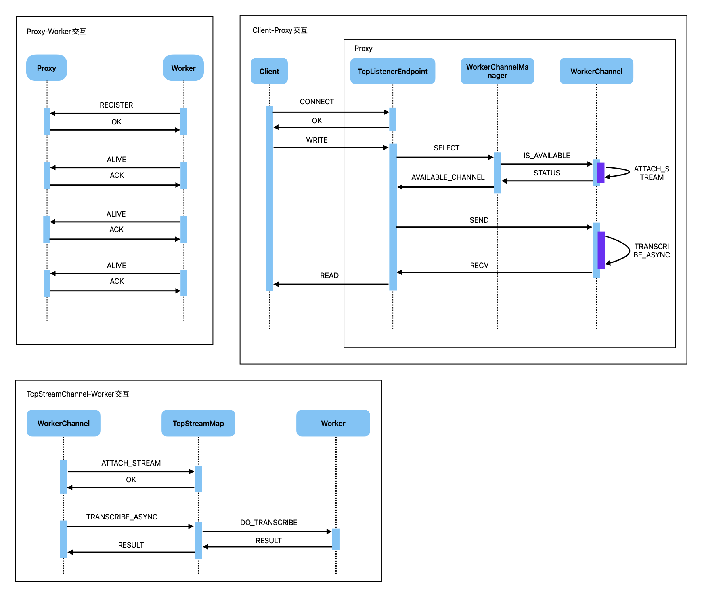

# Stt engine
This repo is a stt engine based on [sherpa-onnx](https://github.com/k2-fsa/sherpa-onnx). The basic idea is to provide a simple and easy-to-use stt engine for developers. The following picture shows the architecture of stt engine:

## 1. Installing & building dependencies
### 1.1 Downloading third-party dependencies
Firstly, init submodule [sherpa-onnx](https://github.com/k2-fsa/sherpa-onnx) by running:
```
cd ${workspace_folder}
git submodule update --init
```
this will clone the sherpa-onnx repo into `third-party/sherpa-onnx` folder.

then, donwload [libevent](https://libevent.org) (optional, for c-api build) by running:
```
cd third-party
wget "https://github.com/libevent/libevent/releases/download/release-2.1.12-stable/libevent-2.1.12-stable.tar.gz"
tar -xvf libevent-2.1.12-stable.tar.gz
```
### 1.2 Building third-party dependencies
We will build sherpa-onnx and libevent (optional) in `sherpa/third-party/` folder.

Firslty, build sherpa-onnx by running:
```
cd ${workspace_folder}/third_party/sherpa-onnx
mkdir build-shared
cd build-shared
cmake \
  -DSHERPA_ONNX_ENABLE_C_API=ON \
  -DCMAKE_BUILD_TYPE=Release \
  -DBUILD_SHARED_LIBS=ON \
  -DCMAKE_INSTALL_PREFIX=${workspace_folder}/sherpa/third_party/sherpa-onnx \
  -Wno-dev \
  ..
  make -j8
  make install
  ```
  Then, build libevent (optional) by running:
  ```
  cd ${workspace_folder}/third-party/libevent-2.1.12-stable
  ./configure --prefix=${workspace_folder}/sherpa/third_party/libevent
  make -j8
  mak install
  ```
  If your build is failed with error message like ` aclocal-1.15: 未找到命令`, you can try the following command to fix it:
  ```
  autoreconf  -ivf 
  ```
  ## 2. Building stt engine
  ### 2.1 Building sherpa-bridge
  Just run follwoing command to build `libsherpa-bridge.so` for unix-like system, or `libsherpa-bridge.dylib` for macOS:
  ```
  cd ${workspace_folder}/sherpa/sherpa-bridge
  make clean & make
  ```
  If you want to test whether the build is successful, you can run:
  ```
  make test
  ./sherpa_test
  ```
  ### 2.2 Building stt-engine excuable
 We now support both rust and c++ build.
 #### 2.2.1 Rust build
 Executing following command to build stt-engine:
 ```
 cd ${workspace_folder}/sherpa/stt-engine
 cargo build --release
 ```
 #### 2.2.2 C++ build
 Executing following command to build stt-engine:
 ```
 cd ${workspace_folder}/sherpa/stt-c-api
 make clean & make
 ```
## 3. Running stt-engine
### 3.1 Downloading models
We need download models from [sherpa-onnx models](https://k2-fsa.github.io/sherpa/onnx/pretrained_models/online-transducer/zipformer-transducer-models.html#sherpa-onnx-streaming-zipformer-multi-zh-hans-2023-12-12-chinese) repo before we can run stt-engine. By running following command to download models:
```
cd ${workspace_folder}/sherpa/sherpa-models
wget https://github.com/k2-fsa/sherpa-onnx/releases/download/asr-models/sherpa-onnx-streaming-zipformer-multi-zh-hans-2023-12-12.tar.bz2

tar xf sherpa-onnx-streaming-zipformer-multi-zh-hans-2023-12-12.tar.bz2
rm sherpa-onnx-streaming-zipformer-multi-zh-hans-2023-12-12.tar.bz2
ls -lh sherpa-onnx-streaming-zipformer-multi-zh-hans-2023-12-12
```
### 3.2 Running rust build
Executing following command to run stt-engine:
1. run as proxy
```
cd ${workspace_folder}/sherpa/stt-engine
cargo run proxy
```
2. run as worker
```
cd ${workspace_folder}/sherpa/stt-engine
cargo run worker
```
3. run as client
```
cd ${workspace_folder}/sherpa/stt-engine
cargo run client
```
### 3.3 Running c++ build
Executing following command to run stt-engine:
```
cd ${workspace_folder}/sherpa/stt-c-api
./sherpa-c-api
```
## 4.Benchmark
todo!
## 5. Reference
The following open-source projects are used in this repository:
1. `sherpa-onnx`: https://github.com/k2-fsa/sherpa-onnx
2. `libvevent`: https://libevent.org

The model used in this repository is from:
1. `sherpa-onnx`: https://github.com/k2-fsa/sherpa-onnx